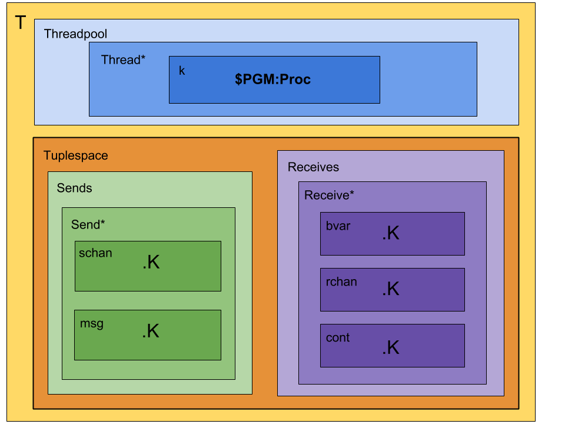

# Rho-calculus in K framework
Reflective higher-order process calculus implemented in K framework

Kompiles in K5 with `--backend java` option

## The calculus
Asynchronous, message-passing calculus

Processes, names, and reflection
```
        P ::= Nil | x(x){P} | x!(P) | P|P | *x
        x ::= @P
```

## Constructors
* Par `_|_: Proc*Proc -> Proc`
* Receive `_(_){_}: Name*Name*Proc -> Proc`
* Send `_!(_): Name*Proc -> Proc`
* Reify `*_: Name -> Proc`
* Quote `@_: Proc -> Name`

## Configuration
There are two main containment cells:
* Activity cell: where concurrent computation happens
  * Concurrently running processes are moved to individual computational threads.
  * The kAST from a parsed program initially goes in a single thread's `k` cell.
* Tuplespace cell: where sends and receives/continuations are stored until a comm event occurs.
  * Sends consist of a channel and a message.
  * Receives consist of a channel, binding variable, and a continuation.

Initial configuration:


## Rules
* Par: spawns new threads for each component
```
        rule <k> P:Proc | Q:Proc => . ...</k>
        (.Bag => <thread> <k> P </k> </thread>)
        (.Bag => <thread> <k> Q </k> </thread>)
```
* Receive: adds a rec to the tuplespace
```
        rule <k> X:Name ( Y:Name ){ P:Proc } ...</k>
        (.Bag => <rec>
                   <rchan> X </rchan>
                   <bvar>  Y  </bvar>
                   <cont>  P  </cont>
                 </rec>)
```
* Send: adds a send to the tuplespace
```
        rule <k> X:Name !( P:Proc ) ...</k>
        (.Bag => <send>
                   <schan> X </schan>
                   <msg>  @P   </msg>
                 </send>)
```
* Quote: removes `*` from sent process `*X`
```
        rule <msg> @ * X:Name => X </msg>
```

### Comm events
```
        x!(Q) | x(y){P}  =>  P[@Q / y]
```

## Concurrency
Several valid reductions for many processes. Kompile `rho.k` with `--transition "comm"` option and krun programs with one of `--search`, `--search-all`, or `--search-final`.

### Combinatorics problem
Consider the program
```
        x!(*a) | x!(*b) | x(z){y!(*z)} | y!(*c) | y!(*d) | y(z){x!(*z)}
```

Two comm events will occur. How many reductions does this process have?

There are twelve possible reduction paths:
* Comm on channel `x` occurs first then
