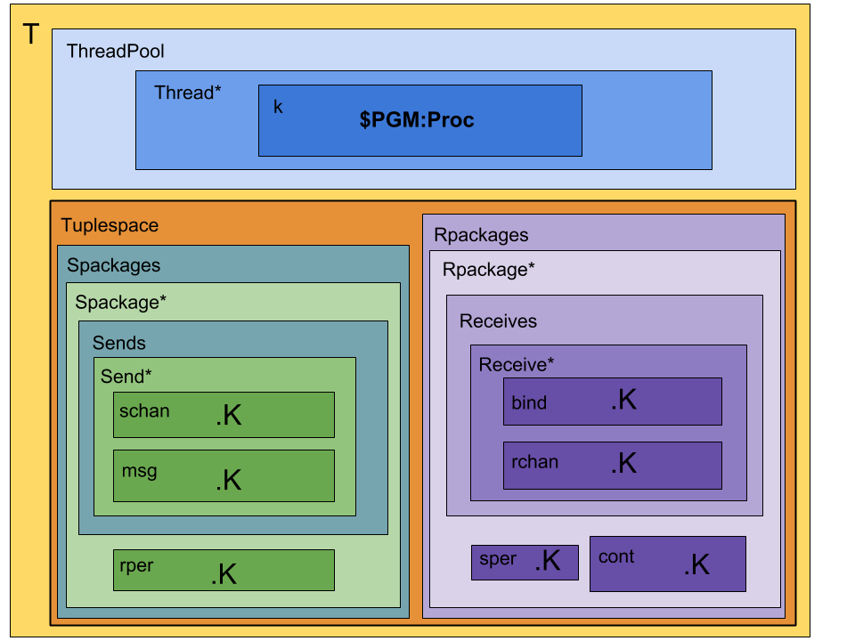

# Rhoguelang: Rho-calculus to Rholang in K

Rho-calc with added:
* Ground terms / basic data structures
  - [x] Bool
  - [x] Int
  - [x] String
- [x] `Nil`
- [x] Bundle: `Bundle { Proc }`
- [x] List: `[ Procs ]`
- [x] Map: `{ Proc : Proc, ... }`
- [x] Set: `{ Procs }`
- [x] Tuple: `( Proc ,) | ( Proc , Procs )`
- [x] Uri: `uri( String )`
* Operations - syntax
  - Conditional
    - [x] `If (x) {P}` (if `x` is `true`, then the first element of the `k` cell rewrites to `P`; otherwise it dissolves)
    - [x] `If (x) {P} else {Q}` (if `x` is `true`, then the first element of the `k` cell rewrites to `P`; otherwise it rewrites to `Q`)
  - [x] Bool: `notbool`, `andbool`, `orbool`
  - [x] Int arithmetic: `+Int`, `-Int`, `*Int`, `/Int`
  - [ ] Mod arithmetic: `%`
  * List
    - [ ] append: `List.append(List): list*list -> list`
    - [ ] *m* th element: `List.nth(m): 'a list -> 'a'`
    - [ ] length: `length(List): list -> int`
    - [ ] slice from *m* to *n*: `List.slice(m,n): list -> list`
  * Map
    - [ ] union: `Map.union(Map): map*map -> map`
    - [ ] delete: `Map.delete(Key): map -> map`
    - [ ] contains predicate: `Map.contains(Key): map -> bool`
    - [ ] get value: `Map.get(Key): map -> value`
    - [ ] get or else: `Map.getOrElse(Key, Proc): map -> map \/ proc`
    - [ ] set value: `Map.set(Key, Value): map -> map`
    - [ ] get keys: `Map.keys(Map): map -> set`
    - [ ] size: `Map.size(Map): map -> int`
  * Set
    - [ ] union: `Set.union(Set): set*set -> set`
    - [ ] contains predicate: `Set.contains(Element): set*proc -> bool`
    - [ ] delete: `Set.delete(Element): set*proc -> set`
    - [ ] size: `Set.size(Set): set -> int`
  * String
    - [ ] concatenation: `String ++ String: string*string -> string`
    - [ ] interpolation: `"${Key}String" %% {Map}: string -> string`
    - [ ] slice from *m* to *n*: `String.slice(m,n): string*int*int -> string`
    - [ ] interpret hex string: `HexString.hexToBytes(): hexstring -> string`
  * Tuple
    - [ ] *m* th element: `tuple.nth(m): tuple -> proc`
  - [ ] All data structures have `toByteArray()`
* Operations - semantics
  - [x] Par
  - [x] Quote
  - [x] Receive
  - [x] Send
  - [x] Persistent receive/send
  - [x] Contract (syntactic sugar: persistent receive)
  - [ ] Bundle: read and/or write
  - [ ] Join
  - [ ] Peek ("comm without consumption")
  - [ ] `new` (unforgeable names)
  - [ ] Logical connectives for patterns
  - [x] Comms (linear and persistent)
  - [ ] Strict functions
  - [ ] Pattern matching
- [x] Process variables
- [x] Name variables
- [ ] Type system
  - [ ] tagged function types

Difference between Rholang and Rho calculus:
* In Rho calculus: `for (@Nil <- x){ P }` is executed for any name which is substituted for any name sent on `x`, which is then substituted for `@Nil` in the continuation `P`.
* In Rholang: `for (@Nil <- x){ P }` only executes when `@Nil` is sent on `x`.

Here's a diagram of the configuration:

