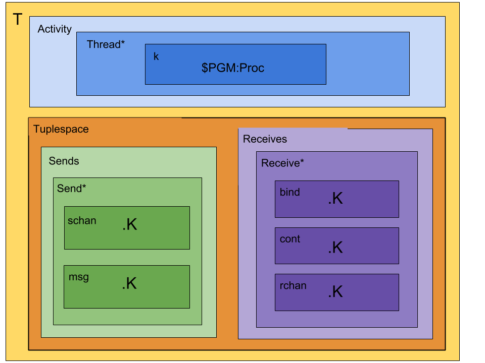

# Rho-calculus in K framework
Reflective higher-order process calculus implemented in K framework

## The calculus
Asynchronous, message-passing calculus

Processes, names, and reflection
```
        P ::= Nil | x(x){P} | x!(P) | P|P | *x
        x ::= @P
```

## Constructors
* Par `_|_: Proc*Proc -> Proc`
* Receive `_(_){_}: Name*Name*Proc -> Proc`
* Send `_!(_): Name*Proc -> Proc`
* Reify `*_: Name -> Proc`
* Quote `@_: Proc -> Name`

## Configuration
There are two main containment cells:
* Activity cell: where concurrent computation happens
  * Concurrently running processes are moved to individual computational threads.
  * The kAST from a parsed program initially goes in a single thread's `k` cell.
* Tuplespace cell: where sends and receives/continuations are stored until a comm event occurs.
  * Sends consist of a channel and a message.
  * Receives consist of a channel, binding variable, and a continuation.

Initial configuration:


## Rules
* Par
* Receive
* Send
* Quote
* Reify

### Comm Events
```
        x!(Q) | x(y){P}  =>  P[@Q / y]
```

## Concurrency
Several valid reductions for many processes.
