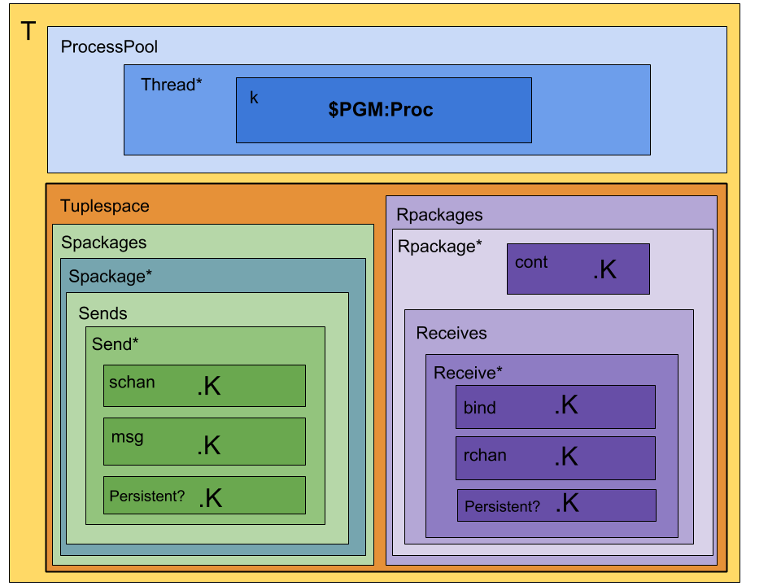

# Rhoguelang: Rho-calculus to Rholang in K

Rho-calc with added:
- [ ] Ground terms / basic data structures
  - [x] `Nil`
  - [x] Bool
  - [x] Int
  - [x] String
  - [x] Bundle
  - [x] List
  - [x] Map
  - [x] Set
  - [ ] Tuple
  - [ ] Uri
- [ ] Operations
  - [ ] Conditional
    - [ ] `If (x) {P}` (if `x` is `true`, then the first element of the `k` cell rewrites to `P`; otherwise it dissolves)
    - [ ] `If (x) {P} else {Q}` (if `x` is `true`, then the first element of the `k` cell rewrites to `P`; otherwise it rewrites to `Q`)
  - [ ] Bool
  - [ ] Bundle?
  - [ ] Int arithmetic
  - [ ] List
  - [ ] Map
  - [ ] Mod arithmetic
  - [ ] Set
  - [ ] String
  - [ ] Tuple
  - [ ] Uri?
- [ ] Operators
  - [x] Par
  - [x] Quote
  - [x] Receive
  - [x] Send
  - [x] Persistent receive/send
  - [x] Contract (syntactic sugar: persistent receive)
  - [ ] Bundle
  - [ ] Join (list substitution)
  - [ ] Peek ("comm without consumption")
  - [ ] `new` (unforgeable names)
  - [ ] Logical connectives
- [ ] Reductions
  - [x] Comms (linear and persistent)
  - [ ] Strict functions
  - [ ] Pattern matching
- [x] Process variables
- [ ] Type system
  - [ ] tagged function types

Difference between Rholang and Rho calculus:
* In Rho calculus: `for (@Nil <- x){ P }` is executed for any name which is substituted for any name sent on `x`, which is then substituted for `@Nil` in the continuation `P`.
* In Rholang: `for (@Nil <- x){ P }` only executes when `@Nil` is sent on `x`.

Here's a diagram of the configuration:

